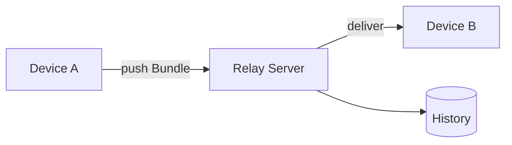

# Relay Concept

Relay is a coordination protocol for cross-device agent handoff. It defines three things: **identity, atomic handoff, and a permanent audit trail**.

This is a **concept contract**: it defines *what*, not *how* — no wire format, transport details, or signing/encryption algorithms.

## 1. Core concepts

### Bundle — The atomic handoff unit

One intentional delivery: files + an intent note + the source device. It is the primary object, with a full lifecycle (§2).

**`Bundle ≠ file sync`** — scp and cloud drives move bytes; a Bundle carries *an intent + a trail*.

```bash
relay bundle push ./dist --note "please continue this codegen" --add-folder /design/review
```

### Device — A first-class identity

A device is *who* is handing off. Identity (binding) is separate from the name (label): renaming does not change identity; revocation ends it.

**`Device identity ≠ device name`** — the name can change; the identity does not.

### History — The permanent audit trail

An append-only event stream: which device handed what to whom, and when. It forms a tamper-evident custody chain (proof of ownership for work products and data).

## 2. Lifecycle

### Device identity

```
binding → session → rotation → revocation
```

### Bundle

```
STAGING (files registered) → UPLOADING (uploading) → READY (pullable) → downloaded/expired (soft delete)
            └────────────── FAILED (upload failed, retryable)
```

## 3. Architecture

Devices hand off through a Relay Server, which leaves a History.



- **Device** — a device node, holding an identity.
- **Relay Server** — the handoff relay, responsible for delivery and audit.
- **Workspace** — a collaboration scope (the boundary of a device group).

> The self-hosted edge and the cloud control plane are deployment shapes of Relay; this document does not define their internals.

## 4. Non-goals

- No model inference.
- No single-device tool calling (that is MCP).
- No file synchronization.
- No signing/encryption algorithm details (only the guarantee: *source is verifiable and unforgeable*).

## 5. Example

Core JSON from `relay bundle push` (`--json` output):

```json
{
  "id": "3f9a2c",
  "note": "please continue this codegen",
  "status": "READY",
  "deviceName": "windows-cli",
  "sizeBytes": 1048576,
  "createdAt": "2026-09-08T00:00:00.000Z"
}
```

Agents can parse `--json` output directly; `relay tools schema` emits a machine-readable list of every command.
