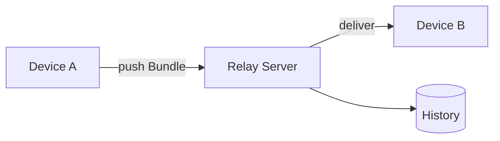

# Relay 概念定义

Relay 是跨设备 agent 交接的协调协议，定义三件事：**识别身份、原子交接、永久追溯**。

本文是**概念契约**：只定义「是什么」，不定义「怎么实现」——不含线协议（wire format）、传输细节、签名/加密算法。

## 1. 核心概念

### Bundle — 原子交接单元

一次有意图的投递：文件 + 意图 note + 来源设备。它是 Relay 的基本操作对象，有完整生命周期（见 §2）。

**`Bundle ≠ 文件同步`** — scp / 网盘搬的是字节；Bundle 交接的是「有意图的投递 + 可追溯」。

```bash
relay bundle push ./dist --note "请继续这个 codegen" --add-folder /design/review
```

### Device — 一等身份

设备是「谁在交接」。身份（binding）与名称（label）分离：改名不改身份，吊销即失效。

**`Device 身份 ≠ 设备名`** — 名字可变，身份不随名字变。

### History — 永久审计

只增不改的事件流：谁在何时交接了什么、谁下载了。它构成不可篡改的 custody chain（成果/数据的主权证据）。

## 2. 生命周期

### 设备身份

```
绑定 binding → 会话 session → 轮换 rotation → 吊销 revocation
```

### Bundle

```
STAGING（登记文件）→ UPLOADING（上传中）→ READY（可拉取）→ 下载/过期（软删除）
            └────────────── FAILED（上传失败，可重试）
```

## 3. 架构

多台设备通过 Relay Server 交接，Server 留下 History。



- **Device** — 设备节点，持有身份。
- **Relay Server** — 交接中继，负责投递与审计。
- **Workspace** — 协作域（设备群组的边界）。

> edge（自托管节点）与云 control plane 是 Relay 的部署形态，本文不定义其内部实现。

## 4. 非目标

- 不定义模型推理。
- 不定义单设备工具调用（那是 MCP 的职责）。
- 不定义文件同步。
- 不定义签名/加密算法细节（只承诺「来源可验证、不可伪造」）。

## 5. 示例

`relay bundle push` 的核心 JSON（`--json` 输出）：

```json
{
  "id": "3f9a2c",
  "note": "请继续这个 codegen",
  "status": "READY",
  "deviceName": "windows-cli",
  "sizeBytes": 1048576,
  "createdAt": "2026-09-08T00:00:00.000Z"
}
```

agent 可直接解析 `--json` 输出；`relay tools schema` 提供全部命令的机器可读清单。
